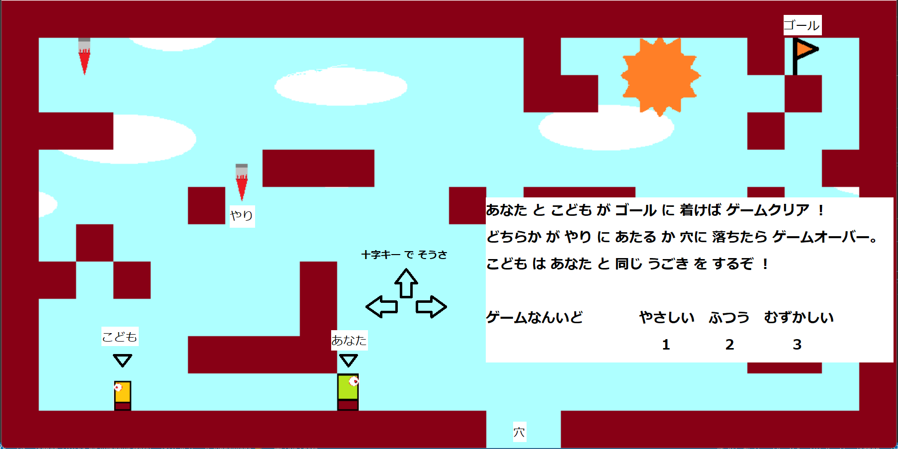

# おやこ の ぼうけん
2体のキャラを同時に動かしゴールを目指す２Dアクションゲームです。
そうさはキーボードのみで行います。

 
# EXPLANATION


<br>[ゲーム開始画面]<br>
<br>
プレーヤーは親となり子供とともにゴールを目指します。<br>
こどもは親であるプレーヤーと同じ動きをしますが、移動速度やジャンプ力などが異なるため常にこどもに気を配りながら進みましょう。<br>
親子のどちらかが穴に落ちるか、画面上からランダムに落ちてくるやりに触たらゲームオーバーです。<br>
プレーヤーとこどもの両方が画面右上にあるゴールにたどり通ことができればゲームクリアとなります。<br>
<br>
<br>
スタート画面では、プレー難易度を選択することができます。キーボード数字ボタンで難易度選択を行ってください。
ボタンが押された時点でゲームが開始されます。


 

 
# Requirement
 
ゲームをプレイするにあたって必要なライブラリなどを列挙する
 
* Python-3.7.19 or than later<br>
* tkinter-8.6.9<br>
* Pillow-8.3.2<br>


# Installation
 
Requirementで列挙したライブラリなどのインストール方法を説明する<br>
Anacondaの仮想環境の作成を推奨します。
```bash
conda create -n sof python=3.7.10 -y
conda activate sof
```
git がインストールされている場合
```bash
git clone https://github.com/Amenbo1219/SHATEKI-of-FUTURE.git
cd SHATEKI-of-FUTURE
```
gitがインストールされていない場合<br>
こちらからソースコードをダウンロードしてください。<br>
github:(https://github.com/junpeiikeda/oyako-no-bouken)<br>
利用プラグインのインストール
```bash
cd Instration
pip install -r requirements.txt
cd ..
``` 
or
```bash
pip install Pillow
```


 
# Usage

* Python3.7.10以上がインストールされているものとする。

* 実行はgame.pyを実行
```bash
python game.py
```
 
# How to use?
移動→キーボードカーソルキー　→↓←<br>
ジャンプ→キーボードカーソルキー↑
 
# Author
 
* 作成者 池田純平
* E-mail c0b20010c8@edu.teu.ac.jp
